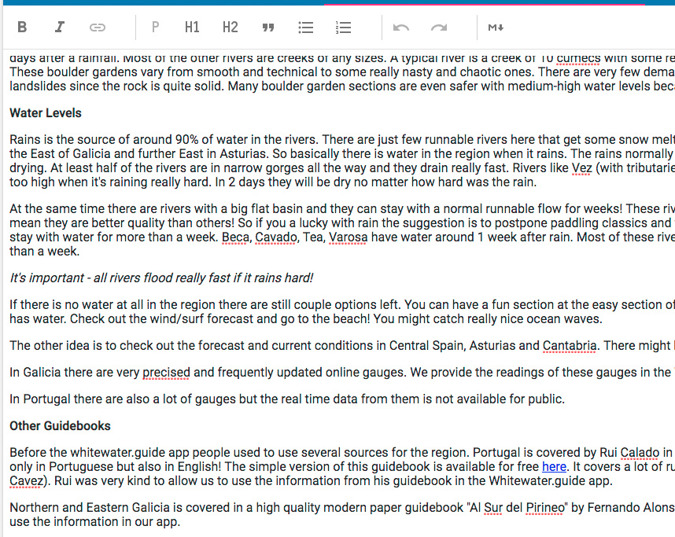
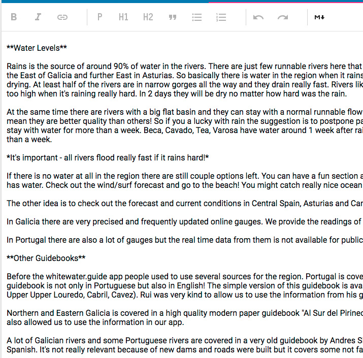

# md-editor

Markdown editor for whitewater.guide. Based on [ProseMirror](http://prosemirror.net)

 

Features:
- WYSIWYG mode
- Raw markdown mode
- Paste from Word docs
- [react-native-markdown-renderer](https://github.com/mientjan/react-native-markdown-renderer) compatible

## Install

Peer dependencies:

```bash
yarn add prosemirror-commands \
         prosemirror-history \
         prosemirror-keymap \
         prosemirror-markdown \
         prosemirror-model \
         prosemirror-schema-list \
         prosemirror-state \
         prosemirror-view

yarn add material-ui@0.20.2
         
```

Dev peer dependencies:

```bash
yarn add -D @types/prosemirror-state 
```

```sh
yarn add @whitewater-guide/md-editor
```
